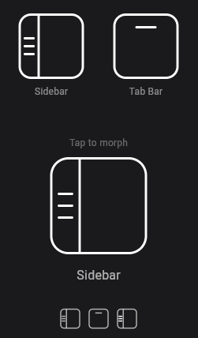

# flutter_icon

A Flutter package providing animated morph icons that transition between **sidebar** and **tab bar** layouts. Built entirely with `CustomPainter` — no image assets or icon fonts required.



## Features

- **MorphSidebarTabBarIcon** — an interactive widget that animates between sidebar and tab bar icons on tap.
- **StaticIconPainter** — a `CustomPainter` for rendering a static sidebar or tab bar icon at any size.
- Fully customizable size, color, and stroke width.
- Zero dependencies beyond the Flutter SDK.

## Installation

Add to your `pubspec.yaml`:

```yaml
dependencies:
  flutter_icon:
    git:
      url: https://github.com/user/flutter_icon.git
```

## Usage

### Animated morph icon

```dart
import 'package:flutter_icon/flutter_icon.dart';

MorphSidebarTabBarIcon(
  size: 48,
  color: Colors.white,
  onToggled: (isSidebar) {
    print(isSidebar ? 'Sidebar' : 'Tab Bar');
  },
)
```

### Static icons

```dart
import 'package:flutter_icon/flutter_icon.dart';

// Sidebar icon
CustomPaint(
  size: const Size.square(24),
  painter: StaticIconPainter.sidebar(color: Colors.white),
)

// Tab bar icon
CustomPaint(
  size: const Size.square(24),
  painter: StaticIconPainter.tabBar(color: Colors.white),
)
```

## Parameters

### MorphSidebarTabBarIcon

| Parameter | Type | Default | Description |
|-----------|------|---------|-------------|
| `size` | `double` | `24.0` | Icon size (width & height) |
| `color` | `Color` | `Colors.white` | Stroke color |
| `strokeWidth` | `double?` | `null` | Custom stroke width (auto-calculated if null) |
| `onToggled` | `ValueChanged<bool>?` | `null` | Callback with `true` for sidebar, `false` for tab bar |

## License

MIT
